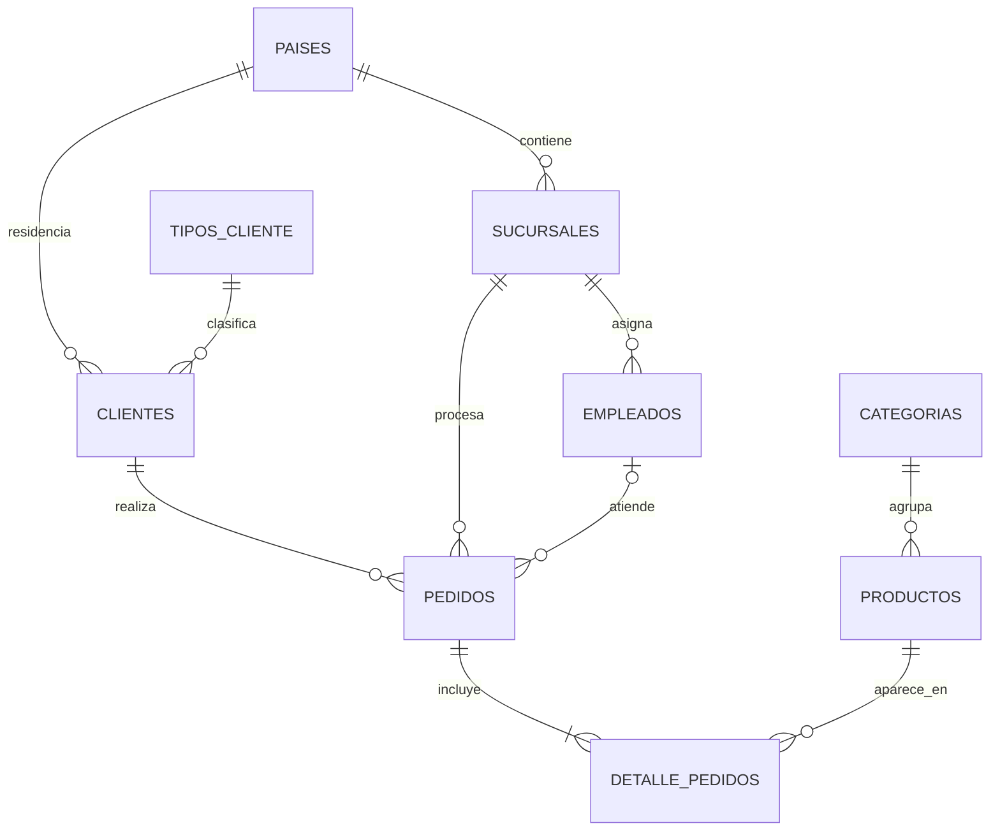

# capstone_project

```mermaid
erDiagram
    PAISES ||--o{ SUCURSALES : contiene
    PAISES ||--o{ CLIENTES : residencia
    TIPOS_CLIENTE ||--o{ CLIENTES : clasifica
    SUCURSALES ||--o{ EMPLEADOS : asigna
    CLIENTES ||--o{ PEDIDOS : realiza
    SUCURSALES ||--o{ PEDIDOS : procesa
    EMPLEADOS o|--o{ PEDIDOS : atiende
    PEDIDOS ||--|{ DETALLE_PEDIDOS : incluye
    CATEGORIAS ||--o{ PRODUCTOS : agrupa
    PRODUCTOS ||--o{ DETALLE_PEDIDOS : aparece_en
```