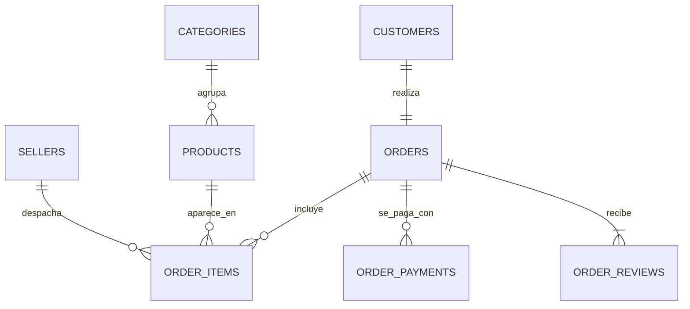

# Modelo de datos — esquema `core`

## Notas de cardinalidad

**`CUSTOMERS ||--|| ORDERS` es 1:1, no 1:N.** `customer_id` es una clave por pedido,
no por persona: 99.441 clientes y 99.441 pedidos. La persona real es `customer_unique_id`,
que sí se repite. Agrupar por `customer_id` para buscar clientes leales devuelve a todos
con un único pedido.

**`ORDERS ||--o{ ORDER_ITEMS` es opcional.** 775 pedidos no tienen ninguna línea
(cancelados o con producto no disponible). Un `INNER JOIN` los descarta en silencio.

**`ORDER_PAYMENTS` es 1:N.** Un pedido puede pagarse con varios medios
(`payment_sequential`). Sumar `payment_value` en el mismo `JOIN` que `order_items`
duplica importes: agregar cada rama por separado con CTEs antes de cruzarlas.

`GEOLOCATION` queda fuera del alcance del análisis. De incorporarse, cuelga de
`CUSTOMERS` y `SELLERS` por `zip_code_prefix`.