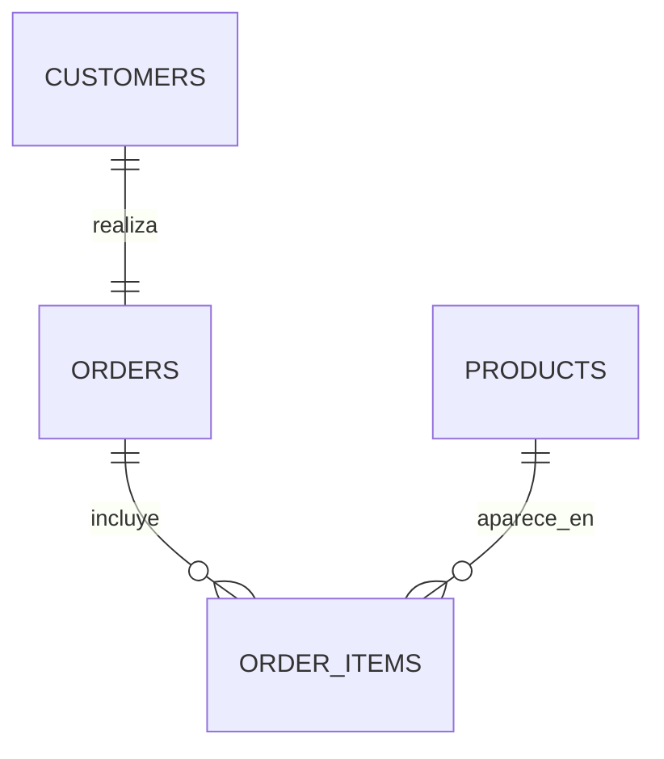

# Capstone SQL — Análisis de ventas de Olist

## Problema de negocio

Olist es un marketplace brasileño. Con alrededor de 100.000 pedidos reales (2016-2018, [dataset de Kaggle](https://www.kaggle.com/datasets/olistbr/brazilian-ecommerce)) la dirección quiere saber **dónde está el ingreso y qué lo pone en riesgo**: quiénes son los mejores clientes, cómo evoluciona la venta, qué parte del catálogo no rinde, qué categorías sostienen el negocio y dónde falla la entrega.

## Cómo ejecutar

Requiere PostgreSQL y `psql`. Desde la carpeta del repo:

```bash
psql -U postgres -f estructura.sql
```

```bash
psql -U postgres -d capstone_project -f analisis.sql
```

> `estructura.sql` usa comandos de psql para cargar los CSV con ruta relativa, por lo que debe correrse con `psql`, no desde el editor de DBeaver/pgAdmin. `analisis.sql` es SQL estándar.

`estructura.sql` crea la base `capstone_project`, carga los CSV de `data/` y limpia los datos.

## Modelo



El dataset está anonimizado: no trae nombres de clientes ni de productos, por eso los productos se describen por su categoría.

## Limpieza

| Problema detectado | Decisión |
|---|---|
| 610 productos (1,9%) sin categoría | `COALESCE(traducción, nombre original, 'sin_categoria')`: un NULL desaparecería de los `GROUP BY` |
| 2.965 pedidos (3%) sin fecha de entrega | No se imputa: son pedidos en tránsito, cancelados o sin stock, una fecha inventada falsearía los plazos. Se excluyen sólo del análisis de entregas |
| Precio y flete: 0 nulos | `COALESCE(flete, 0)` y `CHECK (price > 0)` como defensa ante futuras cargas |
| CSV con todo como texto | Carga a staging `TEXT` y casteo a `TIMESTAMP`, `DATE` y `NUMERIC(10,2)` |
| Pedidos cancelados / no disponibles | Excluidos de la vista `sales`: no generaron ingreso |
| 2016 y sep-2018 con carga parcial | Excluidos sólo de la serie mensual: la variación mes a mes compararía meses no consecutivos |

## Hallazgos

Base: R$ 13,5 M en 98.199 pedidos de 94.983 clientes.

1. **No hay clientes leales o recurrentes.** Cuatro de los cinco mayores compradores hicieron un solo pedido (el primero, R$ 13.440 de una vez) y sólo el 3% de los clientes volvió a comprar. El negocio vive de adquirir clientes nuevos, que es lo más difícil.
2. **Crecimiento fuerte que se estancó.** Las ventas pasaron de R$120.000 (ene-2017) a R$1.000.000 mensual aproximadamente. En Noviembre 2017 saltó +52%, el 24/11/2017 se hicieron 1.166 pedidos(coincide fecha Black Friday), 7 veces el promedio diario de 163, y los 5 días de mayor venta de toda la serie son del 24 al 28 de ese mes. Desde marzo 2018 la venta está plana o cae (−13% en junio), la etapa de crecimiento terminó.
3. **Más de la mitad del catálogo no rota.** 18.205 de 32.951 productos (55%) vendieron una unidad o ninguna, y 222 nunca concretaron una venta. Es catálogo que ocupa espacio en la plataforma y no genera comisiones.
4. **El ingreso está concentrado.** 7 de 74 categorías generan el 50% de la facturación, lideradas por `health_beauty` y `watches_gifts`. Esta última factura casi lo mismo con 36% menos pedidos, productos de mayor coste.
5. **La logística falla lejos de Sao Pablo.** Sao Pablo (38% del ingreso) recibe en 8,7 días con 4,5% de atrasos, en la zona norte (Maranhao, Ceara, Para) se tarda más de 21 días y hasta 17,4% llega tarde. Rio de Janeiro, tiene 12,1% de atrasos.

## Conclusiones

- **Retención antes que adquisición:** con 97% de compradores únicos, un programa de beneficios en su próxima compra puede ser una buena estrategia para combatir esta situación y retomar el crecimiento.
- **Depurar el catálogo:** dar de baja o dejar de promocionar productos sin ventas y concentrar inventario y marketing en las 7 categorías que sostienen el negocio.
- **Logística regional:** priorizar Rio de Janeiro (más volumen y peor logística) y evaluar un nuevo centro de distribución en la zona, mientras tanto, ajustar la fecha de entrega prometida en esas zonas para no incumplirla.
- **Planificar Black Friday:** es el pico del año: asegurar stock y capacidad logística con anticipación.
